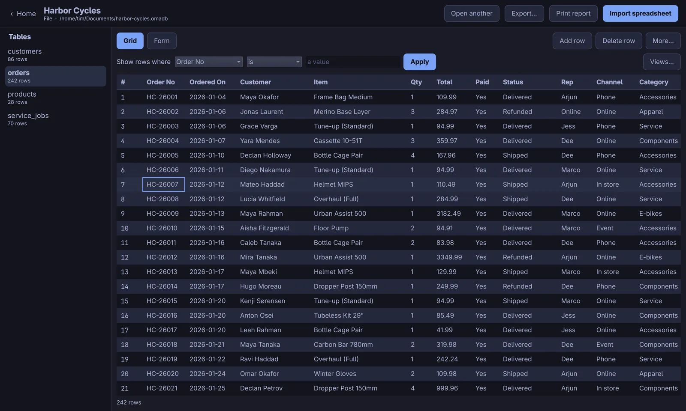
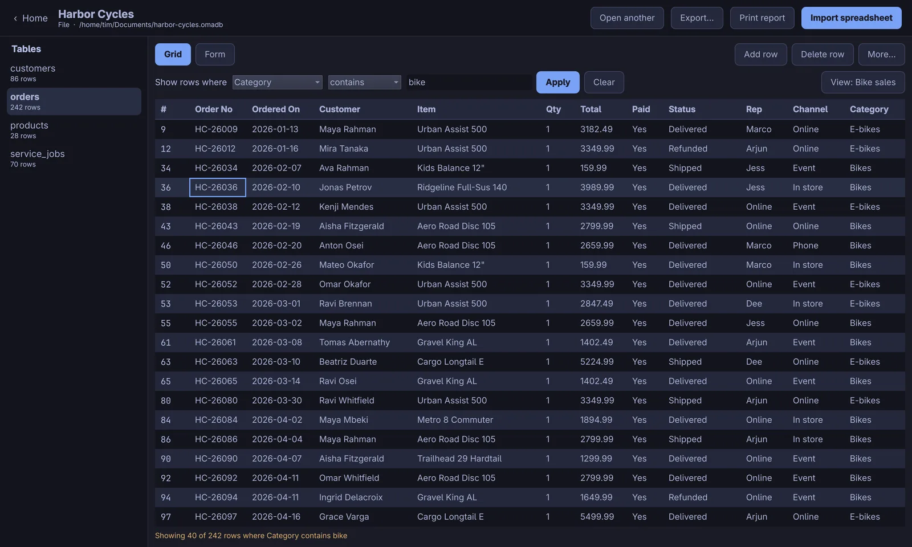
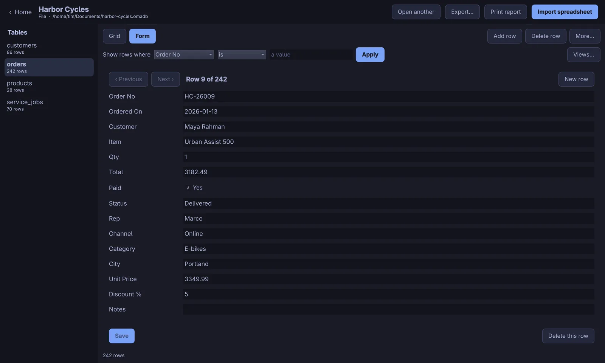
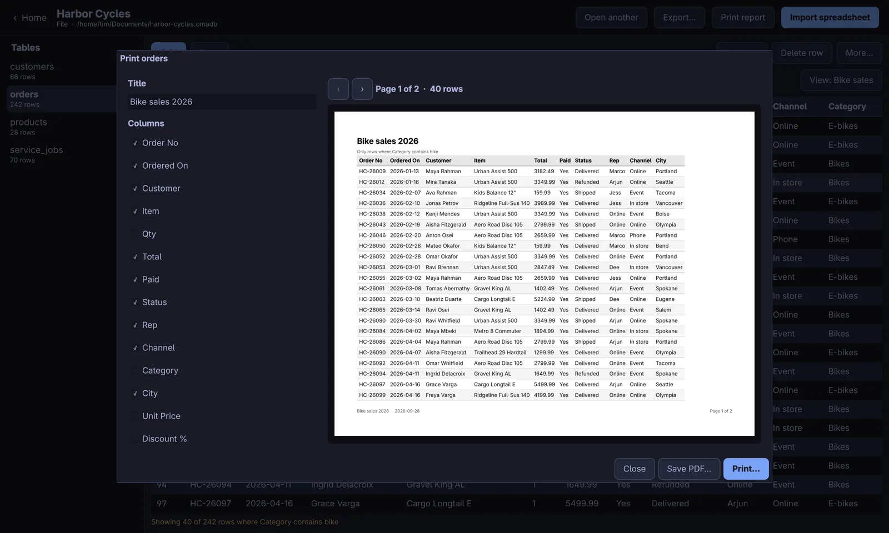
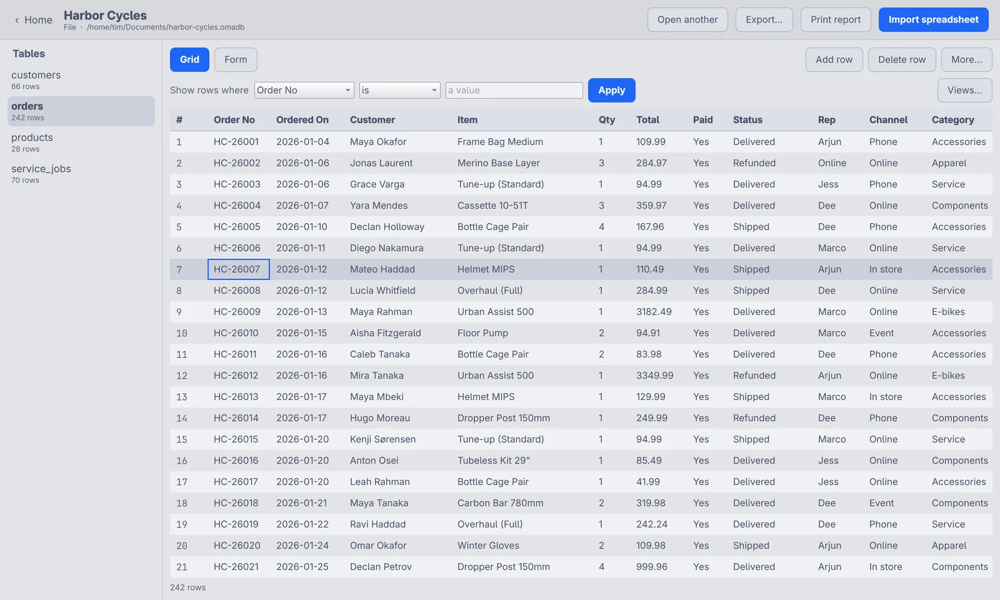

# Jubako

A simple database for your own computer, made for [Omarchy](https://omarchy.org/) Linux.

Think of the old Microsoft Access, without the hard parts. Make a database,
put a spreadsheet in it, look at your rows, print a tidy list. No SQL to learn,
no server to set up, no account to make.

A *jūbako* is the stacked Japanese lunch box: one box, several tiers. Jubako
is one file with several tables.



**Status: usable, still young.** Make a database, import a CSV or Excel file,
browse and edit rows in a grid or one at a time in a form, export to CSV,
Excel or PDF, and print a tidy report that fits the page. The command line
and the MCP server for agents do the same jobs. See [STATUS.md](STATUS.md)
for exactly what works today.

## What you can do

- **Make a database.** It is one file on your computer. Copy it, back it up, email it.
- **Import a spreadsheet.** Drop a CSV or Excel file on the window. Jubako
  works out each column (words, whole numbers, numbers with decimals, dates,
  or yes/no), shows you its guesses, and lets you change them before anything
  is written. A workbook with several sheets can become one table per sheet.
- **Look at your rows.** A grid of everything in a table. Tap a row to pick
  it, double-tap a cell to change it.
- **Type into a form.** One record at a time: Previous, Next, Save, New row.
- **Change your mind.** Add a field, rename a field, delete a field, delete
  a table, or delete the whole database file. The destructive ones ask first.
- **See only some rows.** "Show rows where Moved is not Yes" hides the rest
  in the grid and the form, and a printed report can use the same rule.
  Save a rule you keep using as a view, like "Still here", and it lives in
  the database file.
- **Print a tidy report.** Pick the columns, a title, the page size. Columns
  shrink and wrap so the whole table fits the page width. See it before you
  print it, or save it as a PDF.
- **Send it back out.** Write any table to CSV, Excel (.xlsx) or PDF.
- **Let an agent do it.** The MCP server gives Claude Code (or any MCP client)
  the same jobs, so "turn this spreadsheet into a database" just works.

<table>
  <tr>
    <td></td>
    <td></td>
  </tr>
  <tr>
    <td align="center">A saved view: 40 of 242 orders</td>
    <td align="center">One record at a time in the form</td>
  </tr>
  <tr>
    <td></td>
    <td></td>
  </tr>
  <tr>
    <td align="center">The report designer: what you see is what prints</td>
    <td align="center">It follows your Omarchy theme, light or dark</td>
  </tr>
</table>

The screenshots use a made-up bike shop database: 242 orders, 86 customers,
28 products and 70 service jobs, imported from one Excel workbook.

## How it is built

Three pieces, one library underneath:

| Piece | What it is | Command |
|---|---|---|
| **The app** | A Qt Quick / QML desktop window. A small PySide6 host starts it and hands it a bridge to the library. Nothing about databases is written in QML. | `jubako-app` |
| **Reports** | One layout paints the on-screen preview, the PDF and the printer, so what you see is what you get. | in the app, `jubako report`, MCP |
| **The command line** | The same jobs from a terminal or a script. | `jubako` |
| **The MCP server** | The same jobs for agents, over stdio. | `jubako-mcp` |

The window follows your Omarchy theme. It reads the active theme's
`colors.toml`, so it is dark or light, and uses your accent colour, to match
the rest of the desktop. Change theme and the open window changes with it.

## Where your database lives

By default a new database is a single file in your Documents folder, ending in
`.jubadb`. It is an ordinary SQLite file, so nothing is locked away.

Jubako used to be called Omarchy-DB. Its `.omadb` files still open, and the
first open quietly brings them up to date.

If you already run a **PostgreSQL** or **MySQL / MariaDB** server, you can point
Jubako at that instead when you make the database. Same app, same features;
your data stays on your server.

| You pick | What it means | Needs |
|---|---|---|
| Just a file on this computer | The simple one. Nothing to install. | Nothing |
| A PostgreSQL server | A server you already run. | `psycopg` |
| A MySQL or MariaDB server | A server you already run. | `PyMySQL` |

Server passwords are never saved. The app remembers where the server is and
asks for the password again next time.

## Install

### From a package

Each [release](https://github.com/ninepointlabs/jubako/releases) has packages
for Arch (and Omarchy), Debian / Ubuntu, and Fedora. They pull in Python and
Qt from your distro and put Jubako in your app launcher.

```sh
sudo pacman -U jubako-0.2.0-1-any.pkg.tar.zst      # Arch, Omarchy
sudo apt install ./jubako_0.2.0-1_all.deb          # Debian 13+, Ubuntu 26.04+
sudo dnf install ./jubako-0.2.0-1.noarch.rpm       # Fedora 44+
```

Excel files need `openpyxl`: apt and dnf install it along with Jubako, and on
Arch add `python-openpyxl`.

### From source

Jubako needs Python 3.11 or newer. The window (and PDF reports) need Qt 6
and PySide6, which Omarchy already has (`pyside6` and `qt6-declarative`).

```sh
# On Omarchy / Arch these are usually present already
sudo pacman -S --needed pyside6 qt6-declarative

git clone https://github.com/ninepointlabs/jubako.git ~/Projects/jubako
cd ~/Projects/jubako
uv venv --system-site-packages .venv      # or: python -m venv --system-site-packages .venv
uv pip install -e '.[xlsx]'               # or: .venv/bin/pip install -e '.[xlsx]'
```

`xlsx` adds `openpyxl` for Excel files. Add a server backend only if you want one:

```sh
uv pip install -e '.[postgres]'   # PostgreSQL
uv pip install -e '.[mysql]'      # MySQL / MariaDB
```

To get it in your app launcher (links the commands into `~/.local/bin` and
installs the desktop entry and icon under `~/.local/share`):

```sh
./scripts/install-launcher.sh          # --remove undoes it
```

## Use it

### The app

```sh
jubako-app                        # the home screen
jubako-app ~/Documents/pets.jubadb # open a database straight away
```

The home screen has three big buttons: **New database**, **Open a database**,
**Import a spreadsheet**, and the databases you opened lately. Drop a CSV or
Excel file anywhere on the window and it becomes a database (or a table, if
one is already open). Nothing is replaced without asking first.

Inside a database: **Grid** and **Form** show the same table two ways.
**Add row** and **Delete row** do what they say. **Show rows where…** hides
rows that do not match; **Clear** brings them back; **Views…** keeps a rule
under a name and applies it again later. **More…** holds the rest:
**Add field…**, the Fields list (rename or delete), delete the table, delete
the whole database file.
**Print report** opens the report designer with a live preview, **Print…**
and **Save PDF…**. **Export…** writes the table as CSV or Excel.

### The command line

```sh
jubako backends                                   # what kinds of database you can make
jubako new "My Pets" ~/Documents/pets.jubadb       # make one
jubako import ~/Documents/pets.jubadb pets.csv     # put a spreadsheet in it
jubako import ~/Documents/pets.jubadb book.xlsx --all-sheets   # one table per sheet
jubako tables ~/Documents/pets.jubadb              # what's in there
jubako rows ~/Documents/pets.jubadb pets           # look at the rows
jubako rows ~/Documents/pets.jubadb pets --filter moved is_not yes
jubako save-view ~/Documents/pets.jubadb pets "Still here" --filter moved is_not yes
jubako export ~/Documents/pets.jubadb pets out.csv # send it back out (--format csv|xlsx|pdf)
jubako report ~/Documents/pets.jubadb pets pets.pdf --landscape --title "All the pets"
```

There is a tiny example to try: `data/examples/pets.csv`.

### From an agent (MCP)

Add this to your MCP client. For Claude Code:

```sh
claude mcp add jubako -- /home/you/Projects/jubako/.venv/bin/jubako-mcp
```

Then ask it to do the work:

> Take `~/Downloads/members.csv` and make me a database in Documents.

The tools are `list_backends`, `create_database`, `list_databases`,
`open_database`, `plan_import`, `import_spreadsheet`, `list_tables`,
`describe_table`, `list_rows`, `add_row`, `update_row`, `delete_row`,
`add_field`, `rename_field`, `delete_field`, `delete_table`, `delete_database`,
`list_views`, `get_view`, `save_view`, `delete_view`,
`create_form`, `get_form`, `create_report`, `list_reports`, `delete_report`,
`export_report` and `export_table`. Run `jubako-mcp --tools` to print
their schemas.

## How your columns get their types

When a spreadsheet comes in, each column gets the narrowest type that *every*
filled-in cell fits. Blank cells never decide anything, and anything unclear
stays as words, because words never lose data.

| The column holds | It becomes |
|---|---|
| `yes`, `no`, `true`, `1`, `0` | Yes / No |
| `4`, `-3`, `1,200` | Whole number |
| `12.5`, `6` | Number with decimals |
| `2021-03-14`, `14/03/2021` | Date |
| anything else, or a mix | Words |

The guesses are shown to you before anything is written, and you can change them.

## Safety

- **Files stay where you said.** Every path Jubako opens or writes is
  checked against a list of approved folders — your home directory by default,
  or whatever `JUBAKO_ROOTS` says. A path that climbs out with `../`, or a
  symlink that points outside, is refused. This matters most for the MCP
  server, where an agent supplies the paths.
- **Spreadsheet formulas are never run.** In a CSV, a cell holding `=1+1` is
  stored as the characters `=1+1`. In an Excel file, the value Excel last
  saved for the cell is used; the formula itself is never worked out, and
  macros are never touched.
- **Nothing is replaced quietly.** Writing over a file or a table takes an
  explicit `overwrite` / `--replace` (the app asks you), and the result says
  what it replaced.
- **No passwords are kept.** The list of recent databases remembers how to
  find a server, never how to log into one. Server passwords are passed in at
  the time you connect and are stripped out of anything printed or logged.
- **Names are checked, not escaped.** Table and field names must be plain
  identifiers; anything else is refused rather than quoted around.

Your own settings live in `~/.local/state/jubako/` (owner-only). Your
databases live wherever you put them.

## Developing

```sh
uv venv --system-site-packages .venv
uv pip install -e '.[dev,postgres,mysql]'
.venv/bin/python -m pytest
```

The tests cover type guessing, path safety, the SQLite backend end to end,
CSV and Excel import and export, reports (column fitting, pagination, PDF,
the printer path), forms and reports kept in the database, the MCP server
(including a real process over a pipe), and the app: the bridge, the rows
model, editing, the import worker thread, the report preview, following a
theme change, and loading the QML window offscreen with a table on screen.

A live PostgreSQL or MySQL server is not needed for the test suite. To check
one of those for real:

```sh
JUBAKO_PASSWORD=secret .venv/bin/python scripts/smoke_remote.py postgres \
    --host localhost --database jubako_smoke --user postgres
```

### Packages

```sh
scripts/build-packages.sh --test    # Arch, .deb and .rpm into dist/, then install-test each
```

It builds in Docker containers from the committed tree (`--ref v0.2.0` for a
tag), then installs each package in a fresh Debian, Ubuntu, Fedora and Arch
container and checks the command line, the MCP server and the window. When
`pkgver` changes, release the tag, then set `sha256sums` in
`packaging/arch/PKGBUILD` to the tag tarball's checksum.

### Layout

```
src/jubako/       the core: backends, import, export, reports, printing, paths, CLI
src/jubako_app/   the desktop app: PySide6 host, bridge, report bridge, theme, and qml/
src/jubako_mcp/   the MCP server agents attach to
archive/gtk-prototype/  the first (GTK) window, kept for reference only
data/examples/        a small sample spreadsheet
tests/                the test suite
packaging/            the desktop entry, icon, PKGBUILD, rpm spec, and the .deb/.rpm staging script
scripts/              launcher install, package builds, and the server-backend smoke test
```

## Licence

MIT. See [LICENSE](LICENSE).
